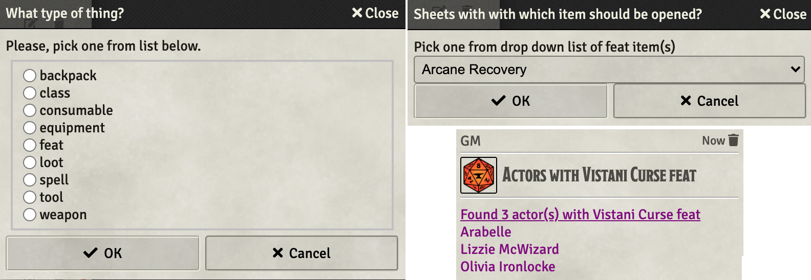

# Utility Macros

This repo holds macros that I have found to be of general utility **and** have foud the time to push to GitHub so that others might make of them what they will.

This readme contains a summary of the functions and for at least some of them a followup section with any notes that I felt worth sharing about each one.

## Functions in this Repo

* **[Open Actor Sheets With...](#open-actor-sheets-with...)** fetchs a list of items from an actor allowing the user to pick one and then opens al of the actor's sheets that contain that item.
* **[Swap Map](swap-map)** swaps the current background image for the next or base. A naming convention must be followed.

https://github.com/Jeznar/Utility-Macros/blob/main/README.md#swap-map
## Notes on Functions

### **Open Actor Sheets With...** 

This macro should be run with a token of interest selected.  The intent of the macro is to make it easier to chec or update all of the users of a given item.  Something I find both common and bothersome. 

It does the following:

1. Finds the types of items on that token (e.g. spell, weapon, etc.),
1. Provides a dialog soliciting the type of interest,
1. Finds all of the items of the specified type,
1. Provides a dialog soliciting a specific item of interest,
1. Opens the sheet of all the actors in the *Actors Directory*.

### Swap Map

This macro will swap the current scene's background image with the *next* image.  If the next image doesn't exist, it swaps to the base image.

A naming convention for the files that are used by this macro is essential.

~~~javascript
File_Name.<SeqNum>.<Extension>
~~~

The file name can be whatever, though, it must be a constant across the set of files used by this macro.  It **must** be followed by a period (.) that delimits the next element. The **SeqNum** (sequence number) is an integer, quite likely single digit, but I know of no limit other than patience of the user.  After the SeqNum is another period (.) that marks the beginning of the file **Extension** (e.g. webp, jpeg, png).

A base image is assumed to exist with SeqNum zero (0) or one (1).  If both exist we are clearly dealing with a programmer at the keyboard and zero will be the starting point.

